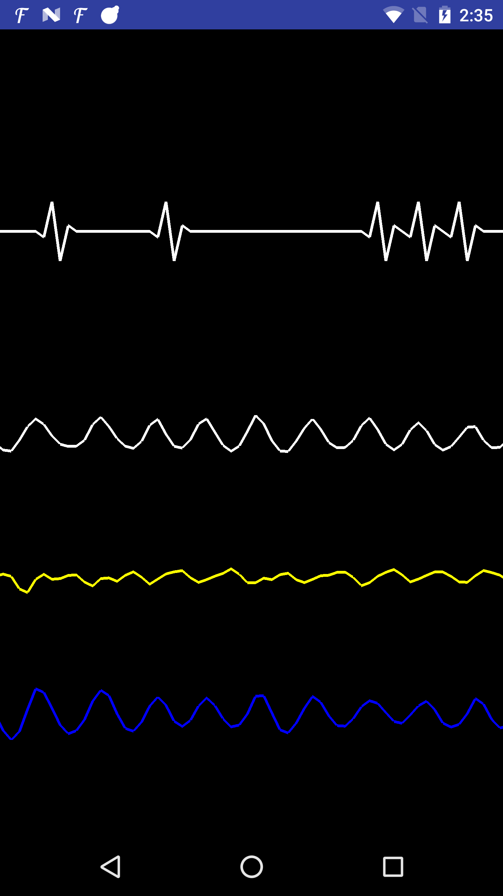

# Sensor-Graph---OpenGL-ES-Android
Sensor-Graph
============
This project is implemented base on an example of Sensor Graph - Open GL - NDK from Gooogle 
(Sensor graph is a C++ Android sample that read current accelerometer values and draw them using OpenGL.)
https://github.com/googlesamples/android-ndk/tree/master/sensor-graph
============
You don't need to know anything about open gl using by NDK and this project provide any functions needed to draw sensor graph (heart graph, g-force graph, speed graph etc)
Pre-requisites
--------------
- Android Studio 

Getting Started
---------------
1. [Download Android Studio](http://developer.android.com/sdk/index.html)
1. Launch Android Studio.
1. Open `Sensor-Graph---OpenGL-ES-Android` sample.
1. Click *Run/Run 'app'*.

Screenshots
-----------

Support
-------
If you've found an error in these samples, please report it to me.

License
-------
 Copyright Khoa Tran

   Licensed under the Apache License, Version 2.0 (the "License");
   you may not use this file except in compliance with the License.
   You may obtain a copy of the License at

       http://www.apache.org/licenses/LICENSE-2.0

   Unless required by applicable law or agreed to in writing, software
   distributed under the License is distributed on an "AS IS" BASIS,
   WITHOUT WARRANTIES OR CONDITIONS OF ANY KIND, either express or implied.
   See the License for the specific language governing permissions and
   limitations under the License.
